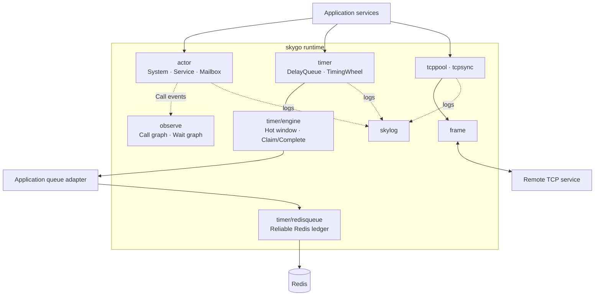
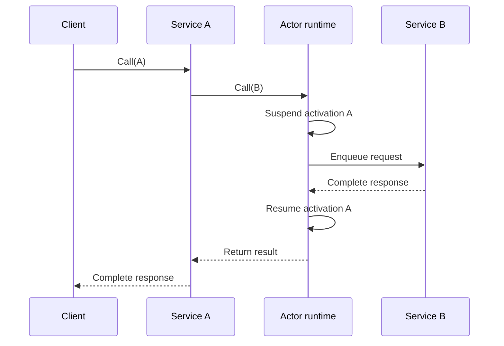

# skygo

skygo is a single-process, Skynet-inspired service runtime for Go with actor, timer, observability, and TCP transport primitives.

It is not a Skynet port, a distributed actor system, or an official Skynet project. References are process-local; skygo does not provide node discovery, remote references, or transparent cross-node calls.

## Packages

- `actor`: named services, generation-safe references, typed methods, mailbox serialization, and cooperative yielding.
- `frame`: bounded 4-byte big-endian length-prefixed framing.
- `tcppool`: asynchronous multi-connection TCP pool with reconnect and backoff.
- `tcpsync`: bounded synchronous request/response TCP pool.
- `skylog`: context-aware logging interface with a `log/slog` default.
- `actor/protoclone`: optional protobuf deep-cloning integration.
- `timer`: delay queues, a one-hour timing wheel, and process-safe ID generation.
- `timer/engine`: generic hot-window scheduling over a persistent queue interface.
- `timer/redisqueue`: optional Redis-backed reliable timer ledger.
- `observe/callgraph`: actor call aggregation through `actor.Observer`.
- `observe/waitgraph`: explicit wait-for cycle detection.

The core actor, timer, observation, framing, logging, and TCP packages have no third-party runtime dependencies. Optional protobuf cloning depends on `google.golang.org/protobuf`; `timer/redisqueue` depends on go-redis/v8.

## Architecture



The packages are independent building blocks: applications may use the actor
runtime without TCP or Redis, and transport packages do not require the actor
runtime.

## Requirements

Go 1.23 or newer.

```sh
go get github.com/scott4game/skygo
```

## Actor example

```go
system := actor.NewSystem(actor.SystemOptions{})
service, ref, err := system.Reserve("echo", actor.ServiceOptions{})
if err != nil {
    log.Fatal(err)
}

echo := actor.NewMethod[string, string]("echo")
if err := actor.Register(service, echo, func(_ context.Context, request string) (string, error) {
    return request, nil
}); err != nil {
    log.Fatal(err)
}
if err := service.Start(context.Background()); err != nil {
    log.Fatal(err)
}

response, err := echo.Call(context.Background(), ref, "hello")
```

A complete runnable version is in `examples/actor_echo`.

## Testing

The default suite includes race-safe contract tests and fuzz seed corpora. The
longer concurrency, reconnect, backpressure, and timer mutation scenarios use
the `stress` build tag:

```bash
go test -race ./...
go vet ./...
go test -race -tags stress -timeout 20m ./...
```

Random actor stress failures print `SKYGO_STRESS_SEED`; set the same variable to
replay the generated operation streams. See [TESTING.md](TESTING.md) for focused
benchmark and fuzz commands.

## Actor concurrency semantics

Each service processes one active mailbox segment at a time. By default, calling another service from a handler cooperatively yields the current service, allowing another queued message to run. This also permits self-calls and call cycles to make progress.



`ServiceOptions.NoInterleave` keeps a handler atomic across a nested call. It trades away cooperative progress and causes head-of-line blocking. A synchronous call back into the same service fails immediately with `actor.ErrCallCycle`; route re-entrant work through `Send` instead. Use this mode only when state invariants span a cross-service call.

With `NoInterleave`, the suspend/resume steps above are deliberately skipped.
The caller keeps ownership of its mailbox segment until the nested call returns.

Mutable typed method values need an explicit clone function, a suitable `Clone` method, or a registered clone provider. For protobuf messages, import the adapter once from the package that assembles the process:

```go
import _ "github.com/scott4game/skygo/actor/protoclone"
```

## Timers and observation

`timer.TimingWheel` runs callbacks with a bounded context. A callback that must
serialize with actor state should use `actor.Send` to enter the owning mailbox.
`timer/engine` adds hot-window promotion and reliable claim/complete processing.
`timer/redisqueue` supplies optional Redis ledger primitives; an application
adapter provides tenant discovery and implements the engine queue interface.

Set an `actor.Observer` in `actor.SystemOptions` to receive completed synchronous
call events. `observe/callgraph.Recorder` is a ready-to-use, concurrency-safe
observer that can export aggregated edges as JSON or JSONL.

## Framing contract

`frame.Read` and `frame.Write` enforce `frame.MaxPayload`. `WriteUnchecked` exists for compatibility with protocols that deliberately configure a larger peer-side read limit. Both write paths handle short writes and never report success for a truncated frame.

`Read` allocates the declared payload after validating it against `MaxPayload`;
the limit is therefore also the maximum per-frame allocation. Network callers
should set read deadlines and bound concurrent readers. The API returns a whole
frame and is not a streaming decoder.

## Status

The public API is pre-1.0 and may change between minor releases. Production adopters should pin a tag. See [CHANGELOG.md](CHANGELOG.md) for changes.

## License

Apache License 2.0. See [LICENSE](LICENSE).
